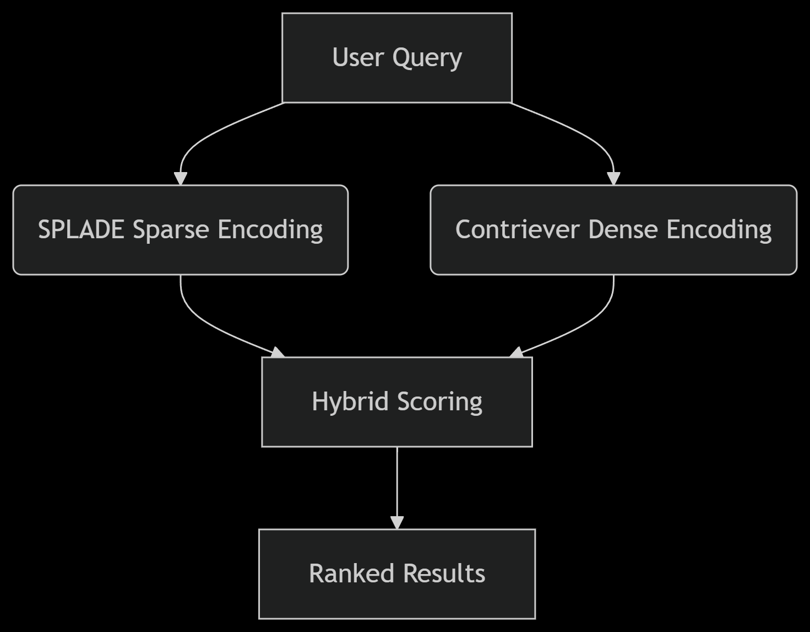

# Hybrid Sparse–Dense RAG Architecture

This diagram explains the high-level architecture of the hybrid retrieval system.

## Overview

The hybrid retrieval pipeline combines:

1. **SPLADE Sparse Encoding** — captures lexical relevance  
2. **Contriever Dense Encoding** — captures semantic similarity  
3. **Hybrid Scoring** — weighted fusion of sparse + dense

The result is a ranked list of passages optimized for both exact match and semantic relevance.

The architecture diagram above illustrates the flow from query to ranked results.
